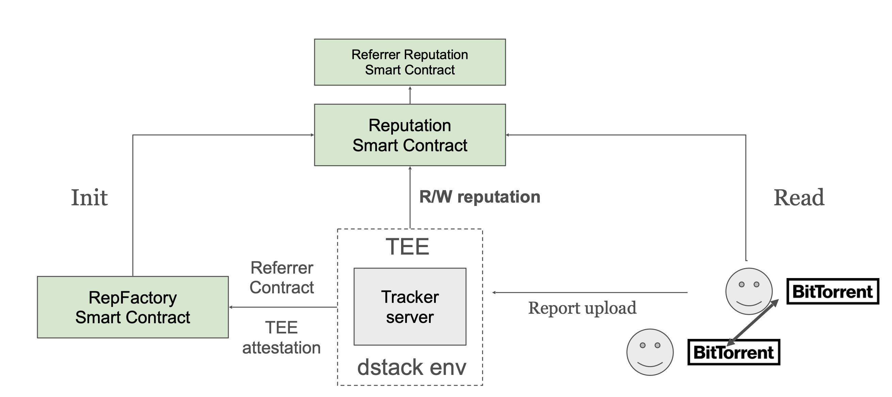

# Smart Contract Design for PBTS

This includes the design of RepFactory and Reputation smart contract.

The overall workflow is as the following:



## Smart Contract Setup

### Prerequisites

```bash
# Install Foundry (for smart contract deployment)
curl -L https://foundry.paradigm.xyz | bash
foundryup

# Install Python dependencies with web3 support
pip install -r requirements.txt

# Start local blockchain (Anvil)
anvil
```

### Configuration

Create `smartcontract/.env` with minimal configuration:

```bash
RPC=http://127.0.0.1:8545
PK0=0xac0974bec39a17e36ba4a6b4d238ff944bacb478cbed5efcae784d7bf4f2ff80
A0=0xf39Fd6e51aad88F6F4ce6aB8827279cffFb92266
```

### Deploy Smart Contracts

```bash
# Deploy ReputationFactory (automatically updates .env)
./deploy_factory.sh
```

This will deploy the factory and add `FACTORY=0x...` to your `.env` file.

### Start Tracker with Smart Contract Support

```bash
# Start the tracker
python tracker.py

# Check smart contract status
curl http://localhost:8000/contract/status
```

## Smart Contract Usage

### 1. Initialize Reputation Contract

```bash
# Create a new Reputation contract via factory
curl -X POST http://localhost:8000/contract/init
```

Response:

```json
{
  "success": true,
  "reputation_address": "0x...",
  "referrer_address": "0x0000000000000000000000000000000000000000"
}
```

### 2. Register User on Smart Contract

```bash
curl -X POST http://localhost:8000/contract/register \
  -H "Content-Type: application/json" \
  -d '{
    "username": "alice",
    "salt": "random_salt_123",
    "password_hash": "0xabcdef1234567890abcdef1234567890abcdef1234567890abcdef1234567890",
    "download_size": 0,
    "upload_size": 0
  }'
```

### 3. Query User Reputation

```bash
curl http://localhost:8000/contract/user/alice
```

Response:

```json
{
  "success": true,
  "user": {
    "username": "alice",
    "salt": "random_salt_123",
    "passwordHash": "0xabcdef...",
    "downloadSize": 1024000,
    "uploadSize": 2048000,
    "ratio": 2.0
  }
}
```

### 4. Update User Statistics

```bash
curl -X POST http://localhost:8000/contract/update \
  -H "Content-Type: application/json" \
  -d '{
    "username": "alice",
    "download_size": 1024000,
    "upload_size": 2048000
  }'
```

### Example Workflow

```bash
# 1. Deploy factory
./deploy_factory.sh

# 2. Start tracker
python tracker.py &

# 3. Initialize reputation contract
curl -X POST http://localhost:8000/contract/init

# 4. Register users
curl -X POST http://localhost:8000/contract/register \
  -H "Content-Type: application/json" \
  -d '{"username": "alice", "salt": "salt123",
       "password_hash": "0x1234...", "download_size": 0, "upload_size": 0}'

curl -X POST http://localhost:8000/contract/register \
  -H "Content-Type: application/json" \
  -d '{"username": "bob", "salt": "salt456",
       "password_hash": "0x5678...", "download_size": 0, "upload_size": 0}'

# 5. Query reputation
curl http://localhost:8000/contract/user/alice
curl http://localhost:8000/contract/user/bob

# 6. Update stats as users download/upload
curl -X POST http://localhost:8000/contract/update \
  -H "Content-Type: application/json" \
  -d '{"username": "alice", "download_size": 500000, "upload_size": 1000000}'

# 7. Check updated ratio
curl http://localhost:8000/contract/user/alice
# Returns: ratio = 2.0 (1000000 / 500000)
```
